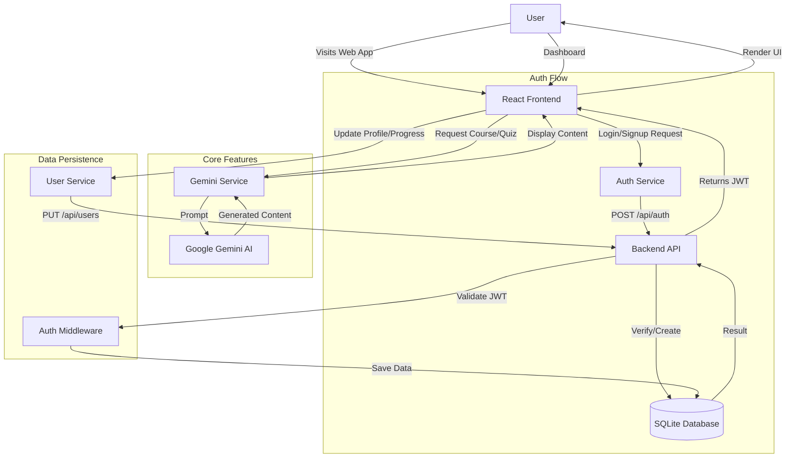

# LearnSphere - AI-Powered Learning Companion

LearnSphere is a modern, AI-integrated educational platform designed to parse the learning experience. It leverages Google's Gemini AI to generate personalized course content, quizzes, and multimedia analysis, creating a dynamic and interactive learning environment.

## 🚀 Features

-   **Personalized Learning Paths**: AI-curated courses based on user interests and goals.
-   **Interactive AI Tutor**: Real-time chat for doubt clearance and lesson explanations.
-   **Smart Quizzes**: Auto-generated quizzes to test knowledge and retention.
-   **AI Lab**: Advanced features including voice-to-text analysis and video content understanding.
-   **User Dashboard**: Track progress, stats, and achievements.
-   **Secure Authentication**: JWT-based login and signup flow.

## 🛠️ Technology Stack

**Frontend:**
-   **React** (Vite) for a fast and responsive UI.
-   **Tailwind CSS** for modern, utility-first styling.
-   **Lucide React / Heroicons** for beautiful iconography.

**Backend:**
-   **Node.js & Express**: Robust server-side logic.
-   **SQLite (`better-sqlite3`)**: Lightweight, file-based database for user data persistence.
-   **JWT & Bcrypt**: Secure authentication and password hashing.

**AI Integration:**
-   **Google Gemini API**: Powers all generative features (courses, chat, image/video analysis).

## 📋 Prerequisites

Before running the project, ensure you have:
-   Node.js (v16 or higher) installed.
-   A Google Gemini API Key.

## ⚙️ Installation & Setup

1.  **Clone the Repository**
    ```bash
    git clone https://github.com/yourusername/learnsphere.git
    cd learnsphere
    ```

2.  **Install Frontend Dependencies**
    ```bash
    npm install
    ```

3.  **Install Backend Dependencies**
    ```bash
    cd server
    npm install
    ```

4.  **Configure Environment Variables**
    Create a `.env` file in the `server` directory with the following content:
    ```env
    PORT=5000
    GEMINI_API_KEY=your_gemini_api_key_here
    JWT_SECRET=your_secure_random_secret_key
    ```
    *(Note: Replace `your_gemini_api_key_here` with your actual API key)*

## 🏃‍♂️ Running the Application

You can run both formatting and backend concurrently from the root directory:

```bash
# From the root directory
npm run dev
```

Or run them individually:

**Frontend (Port 3000):**
```bash
npm run dev:client
```

**Backend (Port 5000):**
```bash
npm run dev:server
```

Open [http://localhost:3000](http://localhost:3000) to view the application.

## 🔄 Application Flow

The following flowchart illustrates the user journey and system architecture:



## 📂 Project Structure

```text
learnsphere/
├── src/                # Frontend Source
│   ├── components/     # UI Components
│   ├── services/       # API integration (Auth, Gemini)
│   ├── App.tsx         # Main Application Logic
│   └── ...
├── server/             # Backend Source
│   ├── src/
│   │   ├── routes/     # Express Routes (Auth, User)
│   │   ├── middleware/ # Auth Middleware
│   │   ├── db.ts       # Database Initialization
│   │   └── ...
│   ├── .env            # Backend Config (Not committed)
│   └── package.json
├── package.json        # Root config
└── README.md           # Project Documentation
```

---

Made with ❤️ by Aajid Ahmad
